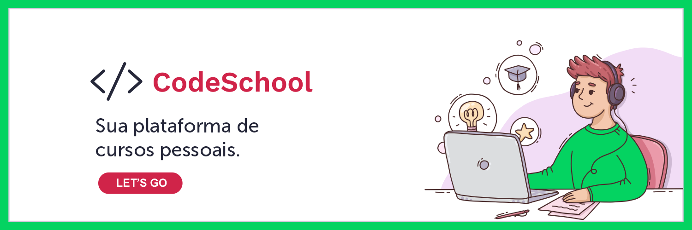
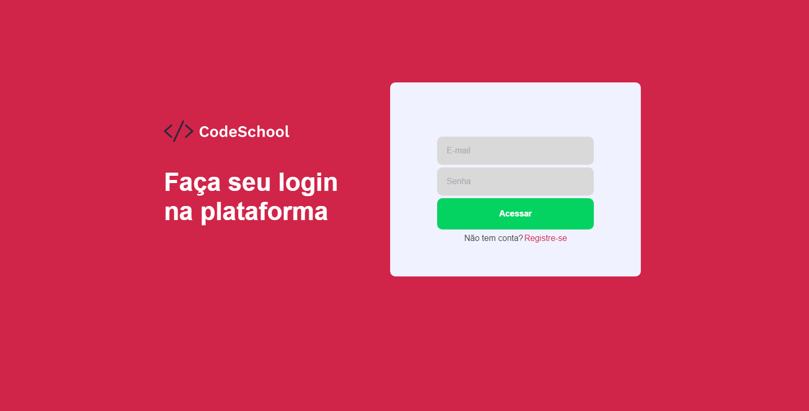
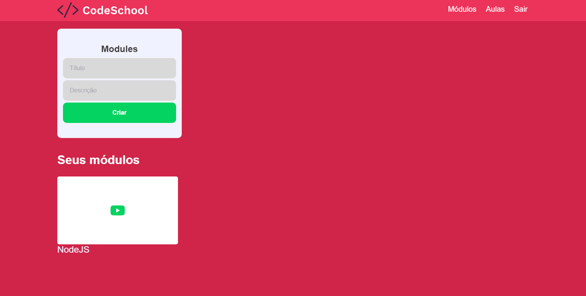
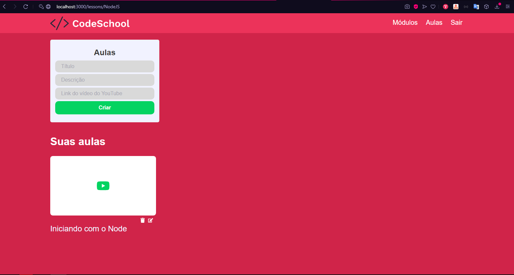
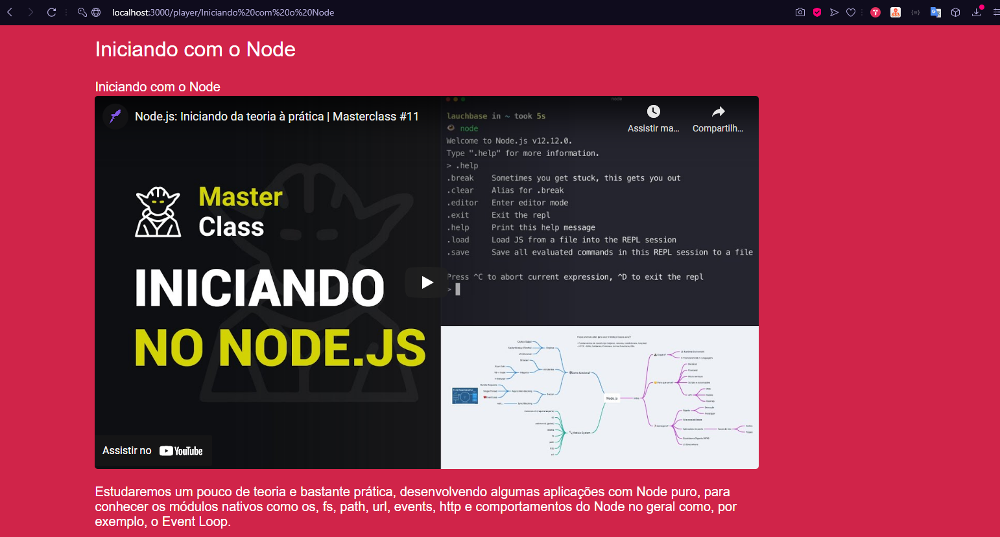

<h1 align="center">
    
</h1>


<h4 align="center">
	 🚀  CodeSchool 🚀
</h4>

Link para a parte Web da aplicação:

* Back-End Node: [https://github.com/RicksonThompson/codeschool-backend](https://github.com/RicksonThompson/codeschool-backend)


## 💻 Sobre o projeto

CodeSchool é uma plataforma de cursos pessoal e personalizável.

Os usuários poderão se cadastrar na aplicação e ter acesso às funcionalidades:
* Criar módulos
* Criar aulas para cada módulo
* Assistir às aulas por meio de um player do YouTube

Projeto foi desenvolvido durante um processo seletivo. O mesmo conta com uma cobertura de 100% de testes no back-end e uma documentação da API no Postman:
* Documentação API: [https://documenter.getpostman.com/view/15815006/TzRX85ic](https://documenter.getpostman.com/view/15815006/TzRX85ic)


## 🎨 Layout

<p align="center" style="display: flex; align-items: flex-start; justify-content: center;">
  

  

  

  

  
</p>

## 🛠 Tecnologias

As seguintes ferramentas foram usadas na construção do projeto:

- [Node.js][nodejs]
- [React][reactjs]
- [TypeScript][typescript]


## 🚀 Como executar o projeto

Podemos considerar este projeto como sendo divido em três partes:
1. Back-End
2. Front-End


💡 O front-end necessita que o back-end esteja sendo executado para funcionar.

### Pré-requisitos

Antes de começar, você vai precisar ter instalado em sua máquina as seguintes ferramentas:
[Git](https://git-scm.com), [Node.js][nodejs].
Além disto é bom ter um editor para trabalhar com o código como [VSCode][vscode]

### 🎲 Rodando o Back-End (servidor)

```bash
# Clone este repositório
$ git clone git@github.com:RicksonThompson/codeschool-backend.git

# Acesse a pasta do projeto no terminal/cmd
$ cd codeschool-backend

# Instale as dependências
$ yarn

# Execute a aplicação em modo de desenvolvimento
$ yarn dev:server

# O servidor inciará na porta:3333 - acesse http://localhost:3333
```

### 🧭 Rodando o Front-End (aplicação web)

```bash
# Clone este repositório
$ git clone git@github.com:RicksonThompson/codeschool-frontend.git

# Acesse a pasta do projeto no seu terminal/cmd
$ cd codeschool-frontend

# Instale as dependências
$ yarn

# Execute a aplicação em modo de desenvolvimento
$ yarn start

# A aplicação será aberta na porta:3000 - acesse http://localhost:3000
```

## 📝 Licença

Este projeto esta sob licença MIT.

Feito com ❤️ por Rickson Thompson 👋🏽 [Entre em contato!](linkedin.com/in/rickson-thompson-892775139/)
